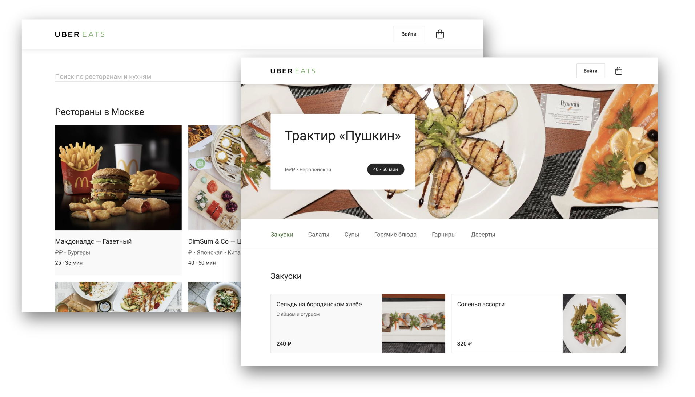
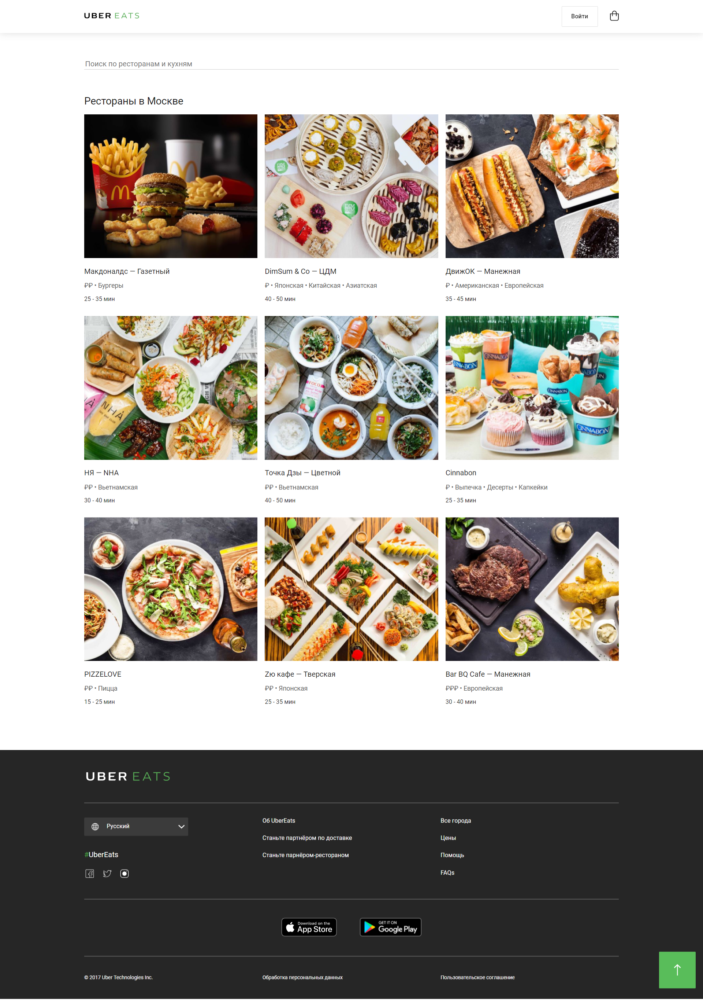
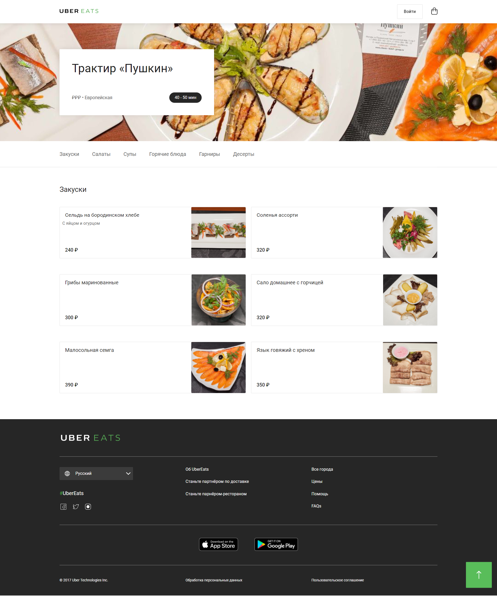

# Выпускной проект Stepik - Uber Eats

Это готовый выпускной проект с курса "Веб-разработка для начинающих: HTML и CSS" (https://stepik.org/course/38218/info).

## Содержание

- [Обзор](#обзор)
  - [Требование](#требование)
  - [Скриншоты](#скриншоты)
    - [Uber Eats](#uber-eats)
    - [Ресторан "Пушкин"](#restaurant-pushkin)
  - [Полезный ресурс](#полезный-ресурс)
  - [Ссылки](#ссылки)

## Обзор

 Необходимо сверстать сайт Uber Eats, состоящий из двух страниц – списка ресторанов и страницы ресторана. Страницы связаны друг с другом ссылками – клик по любому ресторану из списка переносит на страницу с рестораном «Пушкин».  
   
   >Этот макет – изменённая версия макета с закрывшегося навсегда курса по вёрстке Жени Родионова (измененный макет прикреплен в разделе со ссылками).
   >

 

### Требование

_Сайт должен быть сверстан с помощью CSS-сетки [flexboxgrid2](#полезный-ресурс)._

### Скриншоты  

#### Uber Eats  
  
___
#### Restaurant Pushkin  

### Полезный ресурс

- Документация: [flexboxgrid2](https://github.com/evgenyrodionov/flexboxgrid2)

### Ссылки

- URL-адрес решения: [Github](https://github.com/kris-mkv/uber-eats)
- URL-адрес живого сайта: [Github Page](https://kris-mkv.github.io/uber-eats/)
- Макет в фигме: [Макет](https://www.figma.com/file/8lxQ3PGYTHQsCgTXnEJre8/Uber-Eats)

